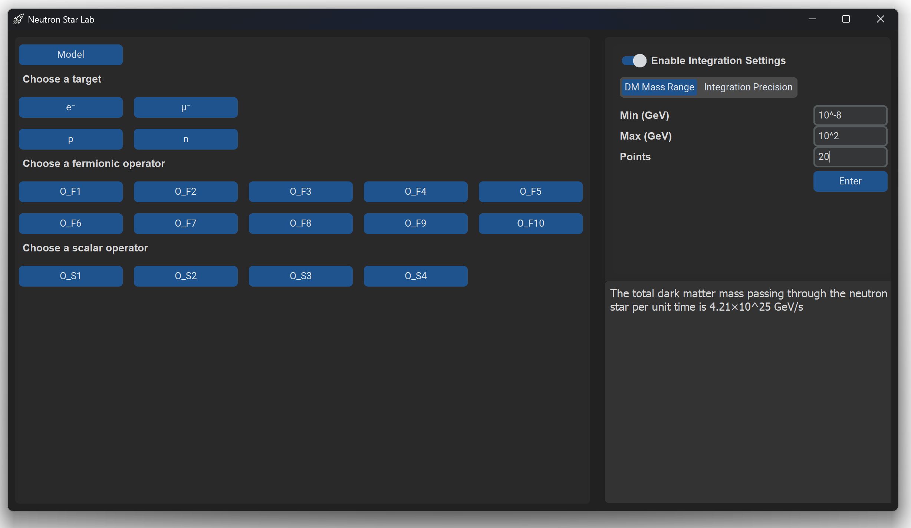
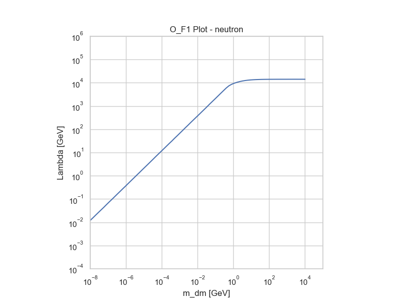

# 🔭 darkNS – Neutron Star Dark Matter Tool

This project provides a modular and interactive Python-based tool to compute upper bounds on the cutoff scale Λ for effective interactions between dark matter and Standard Model particles inside neutron stars.

Within the framework of **Effective Field Theory (EFT)**, interactions are described by fermionic and scalar contact operators. The tool numerically computes the **dark matter capture efficiency (f)** for each operator–target configuration via Monte Carlo integration using the [Vegas](https://vegas.readthedocs.io/en/latest/tutorial.html#introduction) algorithm. 

By identifying the value of Λ for which the capture efficiency reaches the reference threshold of **f = 1**, the tool determines the **discovery reach** on Λ for different dark matter mass values. The implementation follows the methodology proposed in [Joglekar et al., arXiv:2004.09539](https://arxiv.org/abs/2004.09539). Unit consistency is handled via the `quantities` module, and all relevant kinematic relations are implemented explicitly.

> **Note**: electron targets are already integrated into the interface but not yet fully implemented at the computational level. Final refinements are in progress.
---

## 🖥️ GUI Overview

The tool includes an interactive interface where users can:

- Select target particles (electron, muon, proton, neutron)
- Choose scalar or fermionic operators
- Adjust dark matter mass range
- Customize integration settings (nitn, neval, α)
- View plots
- Export results to CSV




## 📥 Installation

Clone the repository and move into the project directory:

```bash
git clone https://github.com/ale-amosso/darkNS.git
cd darkNS
```


---
## 🚀 Usage

After installing the required packages, run the tool with:
```bash
python main.py
```
This will open the graphical interface. All configuration (target selection, operators, integration settings) is done directly through the GUI.

> 💡 **Tip**: Make sure you're in the root directory of the project when launching the script.

---
## 🛠 Requirements

- Python 3.3 or higher
- Required packages:

```bash
pip install numpy matplotlib seaborn tqdm vegas quantities scipy customtkinter
```

## 📂 Project Structure

```plaintext
.
├── main.py                # Entry point - launches GUI
├── controllers/           # Connects GUI to physics functions
├── v_interface/           # GUI modules and layout
├── functions/             # Vegas integration, kinematics, plots
├── dictionaries/          # Physical constants and parameters
├── settings/              # Integration and DM mass defaults

```
## 📤 Output

After the calculation, the tool generates:

- A `.png` plot of Λ as a function of dark matter mass
- A `.csv` file with the numerical values for further processing

Example plot for the `O_F1` operator on a neutron target:



> ⏱️ **Note**: A full run with high precision settings (e.g. 80 mass points from 10⁻⁸ to 10⁴ GeV, 5000 evaluations per iteration) can take several hours to complete depending on your system. For faster previews, consider reducing the number of points or the Vegas precision settings.

## 📚 References

- Aniket Joglekar, Nirmal Raj, Philip Tanedo, Hai-Bo Yu:
  *Dark Kinetic Heating of Neutron Stars from Contact Interactions with Relativistic Targets*, [arXiv:2004.09539](https://arxiv.org/abs/2004.09539)